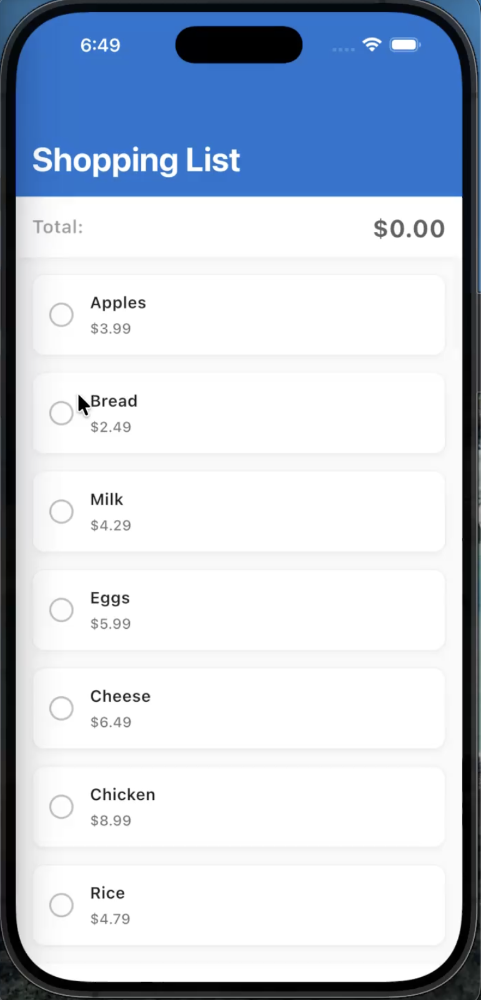

# Shopping List App

A Flutter demonstration app showcasing fundamentals including Sliver widgets, BloC state management, and interactive UI components. This app allows users to create a shopping list, select/deselect items, and see a real-time total calculation.

## Features

- ✅ **Home Screen with Slivers**
  - Collapsible app bar with "Shopping List" title
  - Pinned total price display that remains visible while scrolling
  - Smooth scrollable list of grocery items

- ✅ **Interactive Item List**
  - 10 sample grocery items with names and prices
  - Tap anywhere on an item to select/deselect
  - Visual feedback with animated transitions:
    - Background color change (green tint when selected)
    - Animated checkmark indicator
    - Border highlight
    - Shopping cart icon for selected items

- ✅ **Real-Time Total Calculation**
  - Instant total updates when items are selected/deselected
  - Currency formatting (e.g., "$0.00")
  - Animated number transitions
  - Color changes based on selection state

- ✅ **Audio Feedback**
  - Sound effects for item selection/deselection
  - Graceful fallback to haptic feedback if sound files are unavailable

- ✅ **State Management with BloC**
  - Clean separation of business logic and UI
  - Scalable architecture for complex state management

## Project Structure

This project follows a **feature-based architecture** with clear separation of concerns:

```
lib/
├── core/                               # Core domain models and services
│   ├── models/
│   │   └── grocery_item.dart           # GroceryItem model class
│   └── services/
│       └── sound_service.dart          # Audio/haptic feedback service
│
├── features/                           # Feature-specific business logic
│   └── shopping/
│       └── bloc/                       # Shopping list BloC implementation
│           ├── shopping_list_bloc.dart
│           ├── shopping_list_event.dart
│           └── shopping_list_state.dart
│
├── ui/                                 # UI layer
│   └── home/
│       ├── views/
│       │   └── home_screen.dart        # Main screen with Sliver widgets
│       └── widgets/
│           └── grocery_item_tile.dart  # Reusable item widget
│
└── main.dart                           # App entry point
```

### Architecture Principles

1. **Feature-Based Organization**: Business logic is organized by features (e.g., `shopping/`) rather than by technical layers
2. **Core Domain**: Shared models and services live in `core/` to avoid circular dependencies
3. **UI Separation**: Presentation layer is completely separate from business logic
4. **Reusable Components**: Widgets are extracted into reusable components (`widgets/`)

## Setup Instructions

### Prerequisites

- Flutter SDK ('>=3.4.0 <4.0.0')
- Dart SDK (included with Flutter)
- Android Studio / VS Code with Flutter extensions
- iOS Simulator / Android Emulator or physical device

### Installation Steps

1. **Clone the repository** (or navigate to the project directory)
   ```bash
   cd shopping_app_test
   ```

2. **Install dependencies**
   ```bash
   flutter pub get
   ```

3. **Run the app**
   ```bash
   flutter run
   ```
   
   Or use your IDE's run/debug configuration.

### Optional: Adding Sound Files

The app includes audio feedback functionality. To use actual sound files:

1. Add sound files to `assets/sounds/`:
   - `select.mp3` - Sound played when selecting an item
   - `deselect.mp3` - Sound played when deselecting an item

2. Ensure `pubspec.yaml` includes the assets directory (already configured):
   ```yaml
   flutter:
     assets:
       - assets/sounds/
   ```

**Note**: If sound files are not available, the app gracefully falls back to haptic feedback, so the app works perfectly without them.

## State Management: BloC Pattern

### Choice: BloC (Business Logic Component)

This project uses the **BloC pattern** for state management, implemented via the [`flutter_bloc`](https://pub.dev/packages/flutter_bloc) package.

### Rationale

1. **Separation of Concerns**
   - Business logic is completely separated from UI
   - UI components are stateless and testable
   - Clear data flow: UI → Events → BloC → State → UI

2. **Scalability**
   - Easy to add new features without affecting existing code
   - Supports complex state management scenarios
   - Handles async operations elegantly

3. **Testability**
   - Business logic can be tested independently of UI
   - Events and states are pure Dart classes (no Flutter dependencies)
   - Easy to mock and verify state transitions

4. **Predictability**
   - Unidirectional data flow makes the app behavior predictable
   - Every state change is explicit and traceable
   - Easier to debug with tools like `BlocObserver`

5. **Industry Standard**
   - Widely adopted in Flutter community
   - Extensive documentation and community support
   - Works seamlessly with dependency injection

### How It Works in This App

```
User Taps Item
    ↓
ToggleItemSelection Event
    ↓
ShoppingListBloc Processes Event
    ↓
Updates State (items + totalPrice)
    ↓
BlocBuilder Rebuilds UI
    ↓
User Sees Updated Selection & Total
```

**Example Flow:**
1. User taps "Apples" → `ToggleItemSelection('1')` event dispatched
2. BloC receives event, toggles `isSelected` for item with id '1'
3. BloC calculates new total from all selected items
4. New state emitted: `ShoppingListState(items: [...], totalPrice: 3.99)`
5. `BlocBuilder` rebuilds UI showing "Apples" as selected and total as "$3.99"

### Alternatives Considered

- **Provider + ChangeNotifier**: Simpler but less structured, harder to scale
- **Riverpod**: Modern and powerful, but has a steeper learning curve
- **Redux**: Overkill for this app's complexity
- **setState**: Would work but doesn't scale and mixes business logic with UI

## Key Decisions & Trade-offs

### 1. Sliver Widgets for Scrolling

**Decision**: Used `CustomScrollView` with `SliverAppBar`, `SliverPersistentHeader`, and `SliverList`

**Rationale**: 
- Provides smooth scrolling experience
- Allows collapsible app bar
- Enables pinned total header
- Native Flutter performance optimizations

**Trade-off**: 
- More complex than `ListView` but provides better UX for this use case
- Requires understanding of Sliver geometry constraints

### 2. Feature-Based Architecture

**Decision**: Organized code by features rather than by technical layers

**Rationale**:
- Scales better as app grows
- Easier to find related code
- Reduces risk of circular dependencies
- Common practice in larger Flutter apps

**Trade-off**:
- Slightly more structure than a simple folder organization
- Requires discipline to maintain boundaries

### 3. Singleton Sound Service

**Decision**: `SoundService` implemented as a singleton

**Rationale**:
- Audio player should be shared across the app
- Prevents multiple audio players from being created
- Simple to use: `SoundService().playSelectSound()`

**Trade-off**:
- Global state, but acceptable for services with no internal state
- Could use dependency injection in a larger app

### 4. Haptic Feedback Fallback

**Decision**: Fall back to haptic feedback if sound files are missing

**Rationale**:
- App works immediately without requiring sound assets
- Better user experience than silent failure
- Haptic feedback is also good UX on mobile devices

**Trade-off**:
- Less satisfying than actual sound, but better than no feedback

### 5. Immutable State with Equatable

**Decision**: Used immutable state objects with `Equatable` for value comparison

**Rationale**:
- Prevents accidental state mutations
- Enables efficient rebuilds (BlocBuilder only rebuilds when state actually changes)
- Aligns with functional programming principles

**Trade-off**:
- Slightly more boilerplate with `copyWith` methods
- But prevents bugs and makes state predictable

### 6. Material Design 3

**Decision**: Used Material 3 design system

**Rationale**:
- Modern, clean design
- Built-in theming support
- Consistent with Flutter's default design language

**Trade-off**:
- Could use Cupertino for iOS-specific design, but Material works well cross-platform

### 7. Real-Time Total Calculation

**Decision**: Calculate total synchronously in BloC event handler

**Rationale**:
- Simple and fast for small lists (10 items)
- No async complexity needed
- Immediate UI updates

**Trade-off**:
- For very large lists (1000+ items), might want async calculation
- But unnecessary complexity for this use case

### App Demo

[](https://drive.google.com/file/d/1UEshmIRNcCa-_Qpt6PGrlXjWk2RKFQza/view?usp=sharing)

## Code Quality

- ✅ Follows Flutter style guide
- ✅ Uses `flutter_lints` for code analysis
- ✅ Immutable models with `Equatable`
- ✅ Proper documentation comments
- ✅ Separation of concerns
- ✅ Reusable widgets

## Dependencies

| Package | Purpose | Version |
|---------|---------|---------|
| `flutter_bloc` | State management (BloC pattern) | ^8.1.6 |
| `equatable` | Value equality for immutable classes | ^2.0.5 |
| `audioplayers` | Audio playback for sound effects | ^6.1.0 |
| `intl` | Internationalization & currency formatting | ^0.19.0 |

## Future Enhancements

Potential improvements for production:

- [ ] Persist shopping list to local storage (SharedPreferences/Hive)
- [ ] Add ability to add/remove custom items
- [ ] Undo/redo functionality
- [ ] Categories for items
- [ ] Share shopping list
- [ ] Dark mode support
- [ ] Unit and widget tests
- [ ] Integration tests
- [ ] Analytics tracking

## License

This project is a demonstration app for educational purposes.

## Contact

For questions or feedback, please open an issue in the repository.
